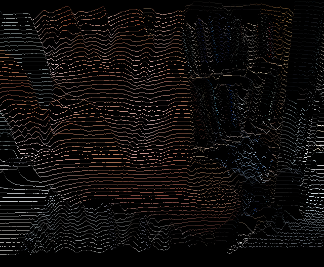

# Rutt-Etra as cv2

## overview

Simple cv2-based Rutt-Etra video effect.

"""
usage: rutt-etra.py [-h] [--outfile OUTFILE] [--lines LINES] [--scale SCALE] [--color | --no-color]
                    [--monitor | --no-monitor]
                    infile

positional arguments:
  infile

options:
  -h, --help            show this help message and exit
  --outfile OUTFILE
  --lines LINES
  --scale SCALE
  --color, --no-color
  --monitor, --no-monitor
"""

If infile is an integer, assumed to be a camera. Output to an AVI file and optionally a monitor window.
