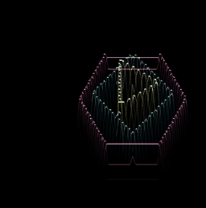
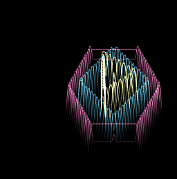
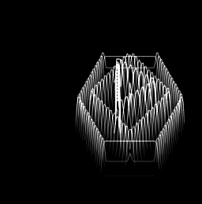
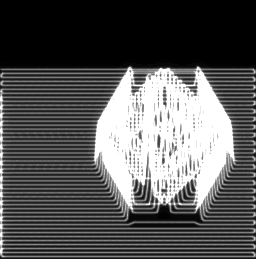
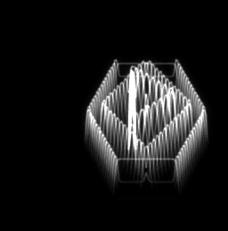
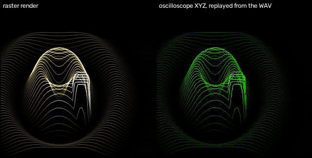

# rutt-etra-cv2

Rutt/Etra scan processor. Displaces each scan line vertically by video luminance and
renders the result as video, as oscilloscope XY(Z) audio, or both from one pass.

The device is an XY vector display, so the core model produces deflection signals
rather than pixels. Video and audio are two renderings of the same beam path.

## Output modes

Every panel below is the same source clip, `docs/media/vector-test.mp4`, scanned at
`--lines 48 --samples 152 --scale 0.35`. Regenerate them with
`python3 tools/make_demo.py`.

| source | `--beam rate` | `--beam speed` |
|---|---|---|
|  |  |  |
| the vector drawing being scanned | the hardware default: fast travel across an edge writes fainter, so the trace thins out where the picture is steep (shown at 3x exposure) | intensity compensation, the option Rutt sold: even brightness along the whole trace |

| `--no-color` | `--audio-channels 2` | `--audio-channels 3` |
|---|---|---|
|  |  |  |
| monochrome raster, as the B&W display unit actually was | simulated scope, X/Y only: with no Z the beam runs flat out and the undisplaced raster shows behind the shape | simulated scope, X/Y/Z: the third channel modulates beam current, so only the picture is lit |

Both scope panels are rendered by `rutt-scope.py` from a real 192 kHz WAV, not from
the frames — the deflection signal is the only thing passed between them.



## Install

```sh
pip install -r requirements.txt
pip install sounddevice   # optional, only for live sound card output
```

Or from Docker Hub, where the first argument picks the tool:

```sh
docker run --rm -v "$PWD:/data" anarkiwi/rutt-etra-cv2 \
  rutt-etra.py /data/in.mp4 --no-monitor --outfile /data/out.avi
```

## Use

```sh
./rutt-etra.py input.mp4                                    # video, with preview
./rutt-etra.py 0 --lines 90 --scale 0.4                     # webcam
./rutt-etra.py input.mp4 --no-video --wav scope.wav \
  --audio-rate 192000 --lines 48 --samples 152 --beam speed # oscilloscope
./rutt-scope.py scope.wav --outfile scope-view.avi          # simulate a scope
```

`--outfile` sets the video path, `--wav` the audio path, `--audio-device` streams to a
sound card, `--scope-out` renders the simulated scope. Any combination can run at once.

`rutt-scope.py` renders a deflection WAV as a monochrome XY oscilloscope, reusing the
same beam kernel as the raster so brightness falls with beam speed as it does on a
real tube, then adding spot size, bloom and phosphor decay.

## Options

| Deflection | |
|---|---|
| `--lines` | scan lines per frame (60) |
| `--scale` | displacement as a fraction of frame height (0.1) |
| `--samples` | samples per line, 0 = source width |
| `--luma` | `bt709`, `bt601`, `mean` |
| `--sampling` | `area` averages lines, `nearest` decimates |
| `--intensity` / `--brightness` | Z-axis gain and pedestal |
| `--v-size` / `--h-size` / `--depth` | raster size, vertical, horizontal, both |
| `--skew` | lean the raster (not an original control) |
| `--smooth` | limit deflection bandwidth along each line |
| `--beam` | `rate` dims fast segments, `speed` compensates |
| `--serpentine` | sweep alternate lines in reverse (on) |
| `--retrace` | blanked samples between lines (8) |
| `--color` / `--invert` | colour the trace, invert the picture |

| Output | |
|---|---|
| `--outfile` / `--video` / `--monitor` | video file, enable, preview window |
| `--exposure` / `--fps` | trace brightness, override source rate |
| `--wav` / `--audio-device` | file or sound card |
| `--audio-rate` / `--audio-channels` / `--audio-bits` | 96000, 2 (XY) or 3 (XYZ), 16 or 24 |
| `--z-invert` | for scopes whose blanking is active high |
| `--scope-out` | render a simulated scope view to this file |
| `--scope-size` / `--scope-aspect` | screen height, width / height (1.0 = square) |
| `--scope-gain` / `--scope-spot` / `--scope-bloom` | brightness, beam spot, halo |
| `--scope-persistence` / `--scope-z` / `--scope-graticule` | phosphor decay, Z channel, grid |

## Docs

- [docs/algorithm.md](docs/algorithm.md) — the signal model, its sources, and how
  faithful it is to the RE4 hardware
- [docs/oscilloscope.md](docs/oscilloscope.md) — channel map, sample budget, sound
  card caveats
- [docs/release.md](docs/release.md) — publishing the Docker image

## Develop

```sh
pip install -r requirements-dev.txt
pytest                        # 149 tests, coverage gate at 85%
black --check . && pylint ruttetra tests
docker build -t ruttetra-test . && docker run --rm ruttetra-test
```
